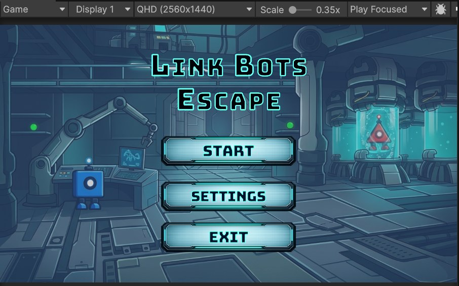
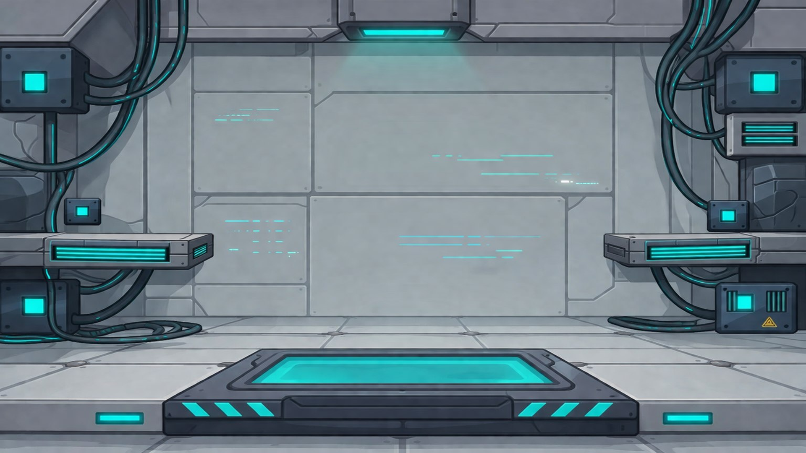
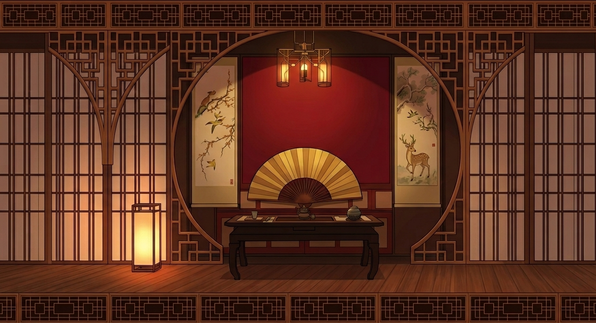
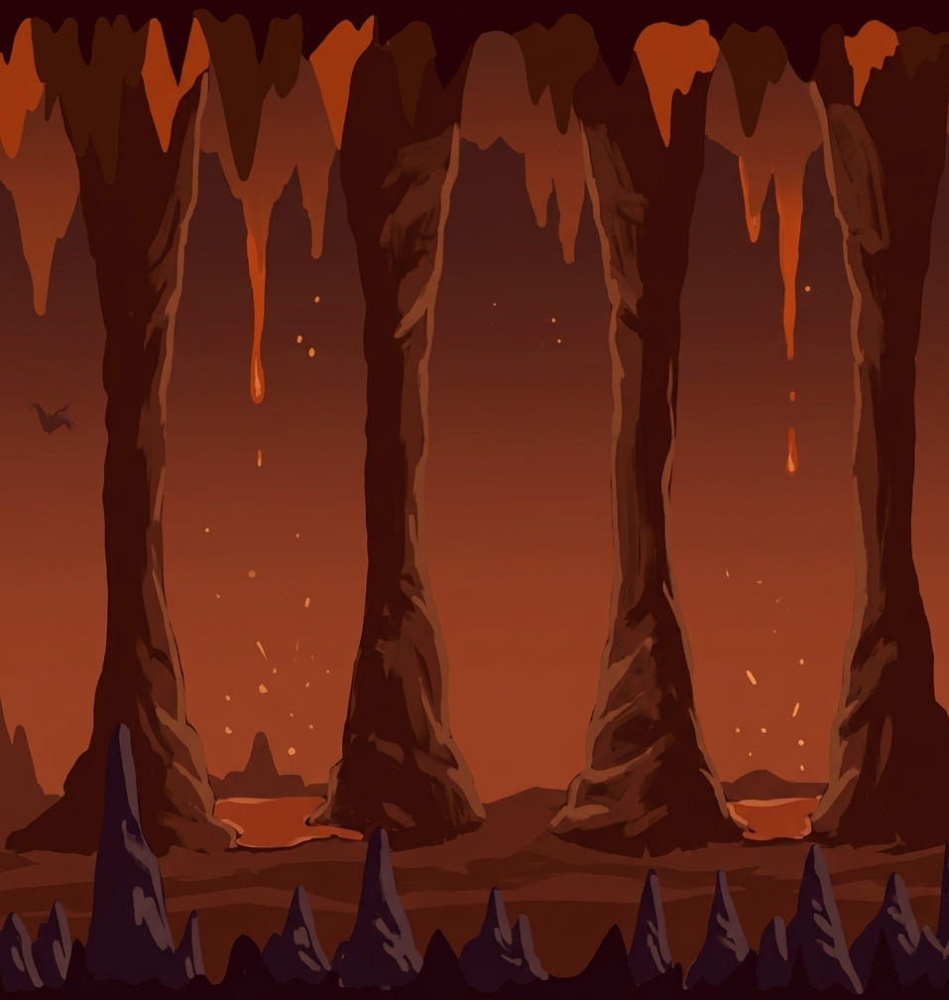
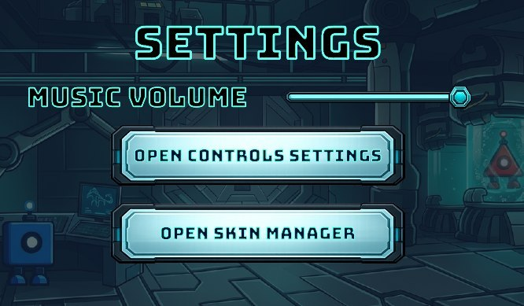
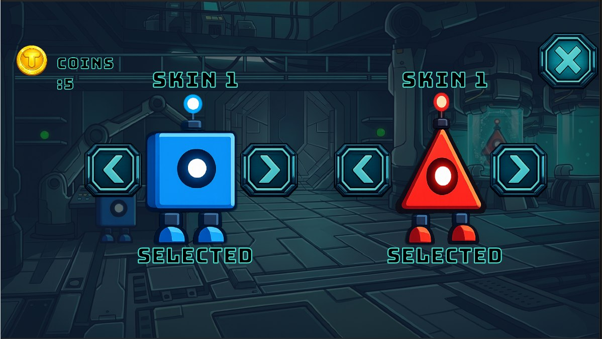

# LinkBots: Escape

A cooperative 2D platformer built with Unity where two robots connected by an energy beam must escape a laboratory full of traps, enemies, and platforming challenges.

🎮 Play the game:
https://linkbots.itch.io/link-bots-escape

---

## About

LinkBots: Escape is a cooperative 2D platformer developed during the TRAILS internship program at GameDev Center / Astana Hub.

The player controls two robots simultaneously on a single keyboard. Unlike traditional platformers, both characters are permanently connected by an energy beam that limits how far they can move apart.

If the robots move too far from each other, the beam stretches and pulls them back together, making synchronization and teamwork the core gameplay mechanic.

Players must coordinate movement, solve platforming challenges, avoid traps, defeat enemies, collect coins and keys, and reach the exit together.

---

## Features

- 9 main campaign levels
- 2 special themed levels
- 1 final level with rising lava
- Unique energy beam mechanic connecting two robots
- Two-player controls on a single keyboard
- Multiple enemy types
- Coins and unlockable character skins
- Collectible keys for level progression
- Shield power-up
- Fire power-up
- Ice platforms
- Moving platforms
- Conveyor belts
- Spring blocks
- Slime blocks
- Pause menu
- Customizable controls
- Responsive UI
- Background music and sound effects

---

## Gameplay

### Objective

Complete each level by guiding both robots safely through obstacles while keeping them connected.

Players must:

- synchronize movement
- avoid traps
- defeat enemies
- collect coins
- collect keys
- unlock new levels

---

## Controls

### Robot 1

- **A / D** — Move
- **W** — Jump

### Robot 2

- **← / →** — Move
- **↑** — Jump

### Other

- **Esc** — Pause Menu

---

## Gameplay Mechanics

### Energy Beam

The two robots are permanently connected by an energy beam.

If they move too far apart, the beam stretches and pulls them back together. This creates unique cooperative gameplay where every movement must be carefully coordinated.

---

### Cooperative Gameplay

Both robots are controlled simultaneously using one keyboard.

Many obstacles require synchronized jumping, movement, and timing.

---

### Enemies

The game includes several enemy types with different behaviors, including:

- Walking enemies
- Shooting enemies
- Flying drones
- Spiked hazards
- Poison cloud obstacles

---

### Power-ups

#### Shield

Protects the player from one hit.

#### Fire Power-up

Allows the player to temporarily shoot projectiles.

---

### Collectibles

#### Coins

Coins can be collected throughout the game and spent to unlock character skins.

#### Keys

Keys are required to unlock the exit and progress to the next level.

---

## Level Progression

The game includes:

- 9 campaign levels
- 2 special themed levels
- 1 final level

Levels are unlocked by completing previous stages.

Players gradually encounter new mechanics, stronger enemies, and more complex platforming challenges.

---

## My Contributions

During this project I worked primarily on level design, UI, game design, testing, and gameplay polishing.

My contributions include:

- Designed and built multiple game levels
- Designed and implemented the complete final level
- Created the Pause Menu interface
- Designed Resume, Restart, and Main Menu buttons
- Improved the Skin Shop interface
- Created UI elements and visual assets
- Adjusted colliders for smoother gameplay
- Balanced enemy and platform placement
- Playtested gameplay mechanics
- Fixed gameplay and collision bugs
- Improved overall player experience

---

## Technologies

- Unity
- C#
- Unity Physics
- Unity Animation
- Tilemaps
- Canvas UI
- Collider2D
- Rigidbody2D

---

## Screenshots

### Main Menu

### Gameplay

### Special Level

### Final Level

### Settings

### Skin Shop

---

## Download

The latest playable version is available on itch.io.

https://linkbots.itch.io/link-bots-escape

---

## Development

This project was developed during the TRAILS internship program at **GameDev Center / Astana Hub** as a collaborative educational project.

---

## License

This repository is intended for portfolio and demonstration purposes.
